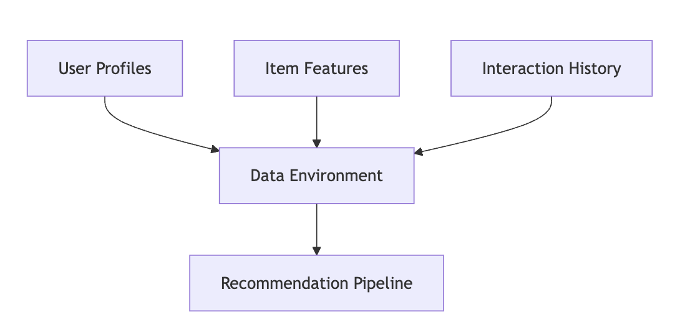
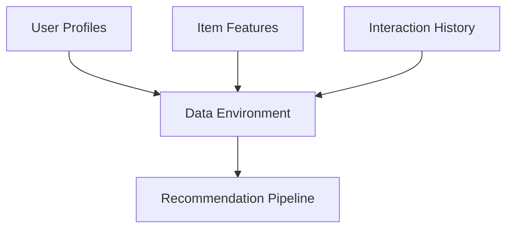
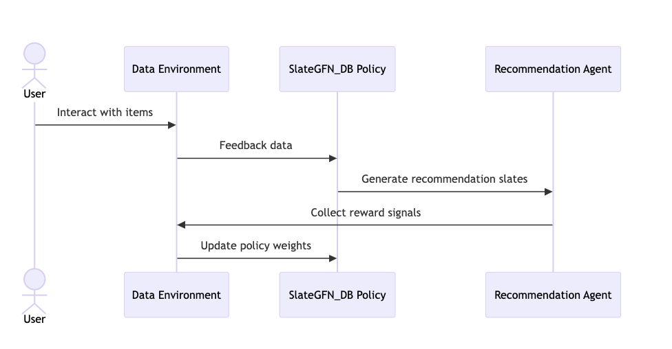
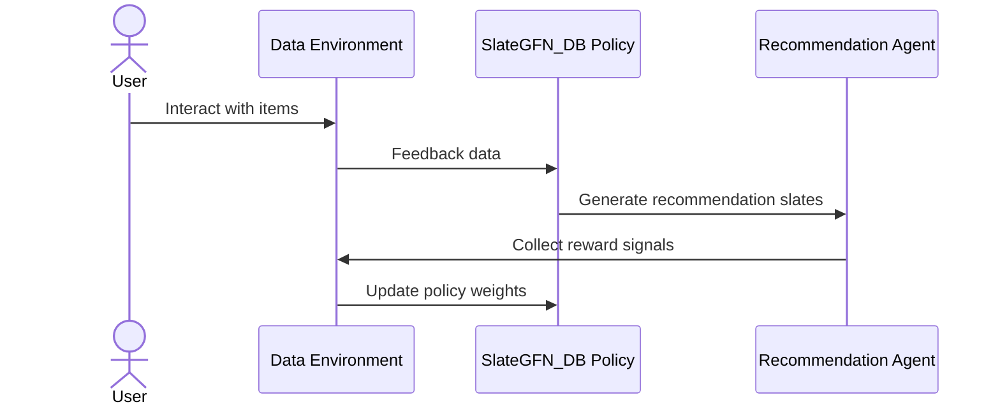
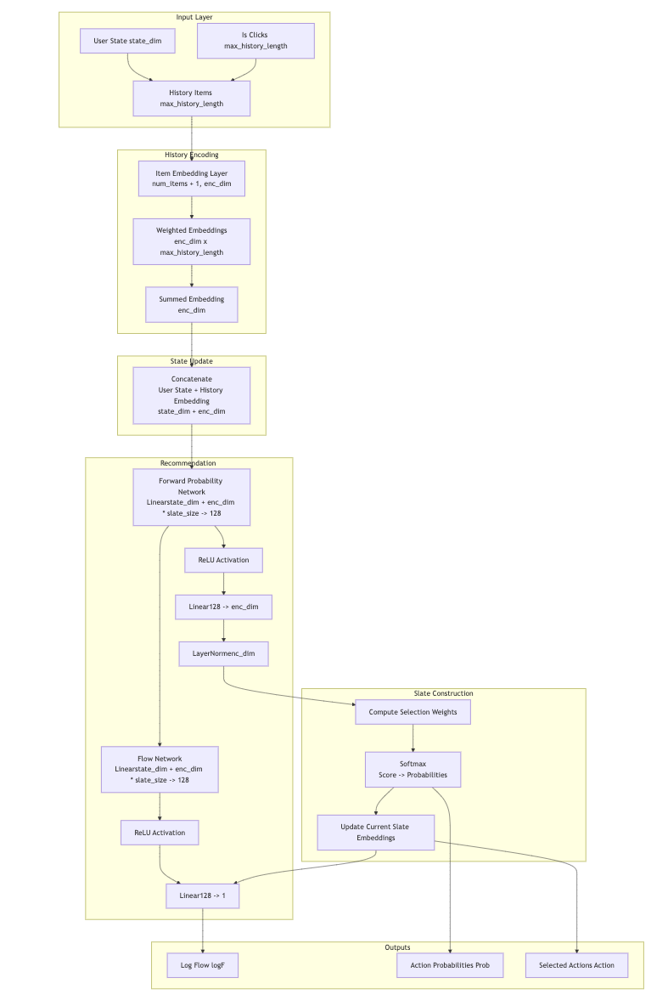
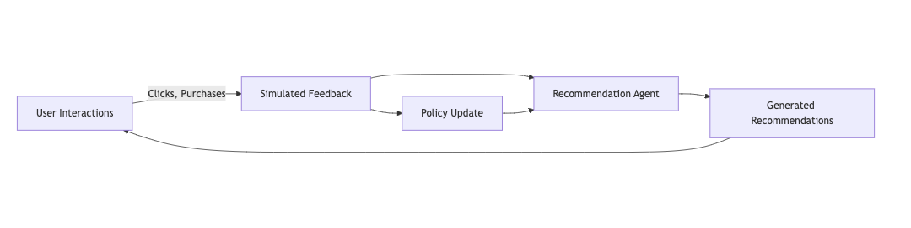
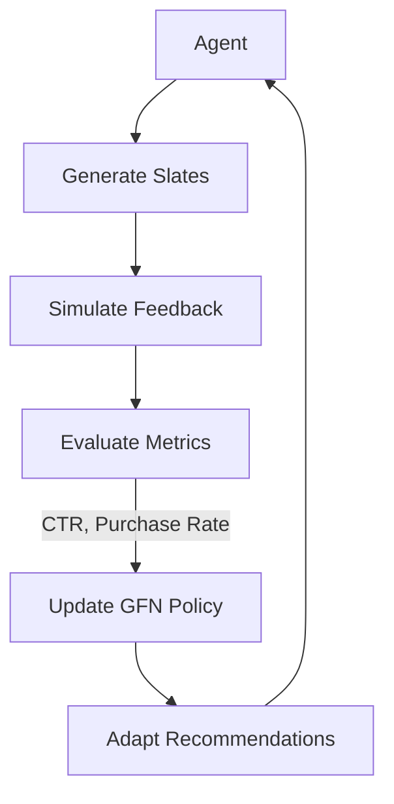
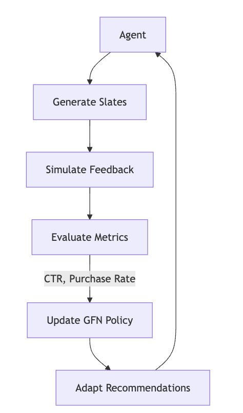

# Building an Online Recommendation with Generative Flow Networks (GFN)


### Introduction

Recommender systems are ubiquitous in digital ecosystems, from e-commerce platforms to content streaming services. Traditional recommendation approaches often focus on static policies, but Generative Flow Networks (GFN) provide a novel paradigm for modeling the sequential dynamics of user interactions. In this blog, we’ll explore the use of trained policies (e.g., SlateGFN_DB) for building an online recommendation prototype. We’ll cover key components like data environment setup, policy training, agent updates, and feedback loops, all while illustrating the process with visual aids, including Mermaid graphs.


In this blogs I will cover the following topics:
1. What is a Generative Flow Network (GFN)?
2. Data Environment for Training
3. Training the Policy
4. Policy Deployment and Online Updates
5. Agent Update in Online Recommendations
6. Conclusion


### What is a Generative Flow Network (GFN)?

Generative Flow Networks (https://yoshuabengio.org/2022/03/05/generative-flow-networks/) are probabilistic models designed to generate diverse, sequential structures. They excel in scenarios where multiple outcomes need to be explored, such as recommending a slate of items to a user. Unlike traditional policies, GFNs allow us to generate sequences with a balance between exploration and exploitation, making them ideal for online recommendation systems.

### How to Build an Online Recommendation with GFN

#### Step 1: Data Environment for Training

To build a robust recommendation prototype, we need a well-defined data environment:

1.	User Profiles: Demographics, preferences, and behavior data.
2.	Item Features: Attributes of items (e.g., product categories, tags, ratings).
3.	Interaction History: Historical data capturing user interactions with items (e.g., clicks, purchases, ratings).

In our system:

1. Daily Recommendations simulate recommendations for users over a timeline.
2. Session-Based Interactions allow us to model multiple touchpoints in a single user session.
3. Time Slots enable periodic updates (e.g., hourly recommendations).







#### Step 2: Training the Policy

To train the recommendation agent:
1.  SlateGFN_DB generates recommendation slates for users.
2.   A reward function evaluates each slate based on metrics like engagement or purchase likelihood.
3.  The training process iteratively updates the policy to maximize the cumulative reward.

The GFN policy learns to generate diverse and high-quality recommendations by:
1.	Exploring diverse item combinations.
2.	Exploiting known user preferences.


    




Design the SlateGFN_DB network ( the code you can find in the repository) to generate slates of items for users. The network learns to balance exploration and exploitation, ensuring that recommendations are both diverse and relevant. The training process involves:




### Step 3: Policy Deployment and Online Updates

Once trained, the policy operates in an online setting, generating recommendations in real-time:
1.	User Selection: Select a subset of active users for recommendations.
2.	Recommendation Generation: Use the trained GFN policy to produce slates.
3.	Simulated Feedback: Gather feedback (e.g., clicks, purchases) to simulate user interactions.
4.	Policy Updates: Continuously update the policy using feedback data.


```maermaid
graph LR
    User[User Interactions] -->|Clicks, Purchases| Feedback[Simulated Feedback]
    Feedback --> Agent[Recommendation Agent]
    Agent --> Recommendations[Generated Recommendations]
    Recommendations --> User
    Feedback --> Update[Policy Update]
    Update --> Agent
```


#### Step 4: Agent Update in Online Recommendations

Key Elements

	•	Exploration: The agent tests new item combinations to identify novel preferences.
	•	Exploitation: The agent prioritizes high-probability interactions based on historical data.
	•	Real-Time Adaptation: Policies are updated periodically, ensuring relevance in dynamic environments.

The agent learns iteratively:
	•	Generate slates.
	•	Simulate feedback using metrics like click-through rate (CTR) or purchase conversion rate.
	•	Update the GFN policy.





### Conclusion

This prototype demonstrates how Generative Flow Networks can revolutionize online recommendation systems by combining sequential interaction modeling, exploration of diverse outcomes, and adaptive policies. Using a trained policy like SlateGFN_DB, you can build a scalable and robust recommendation engine for real-world applications.

As a next step, consider implementing this prototype with your own datasets to explore its potential for driving engagement and conversions in your platform.

This my code reporesitory for the blog post: [Building an Online Recommendation with Generative Flow Networks (GFN)]()


     

