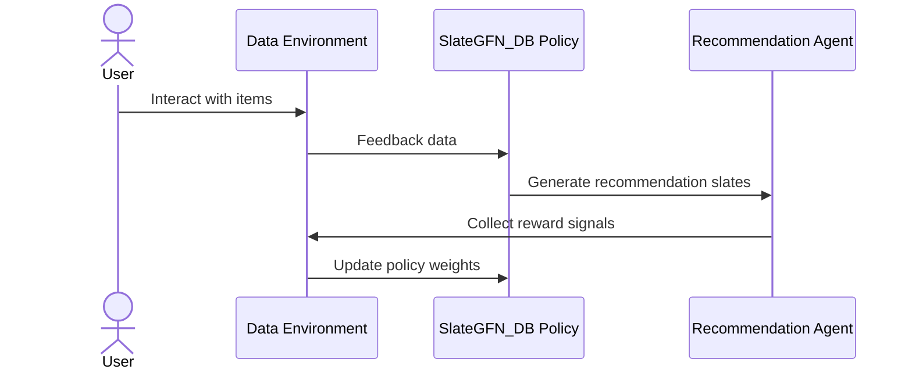
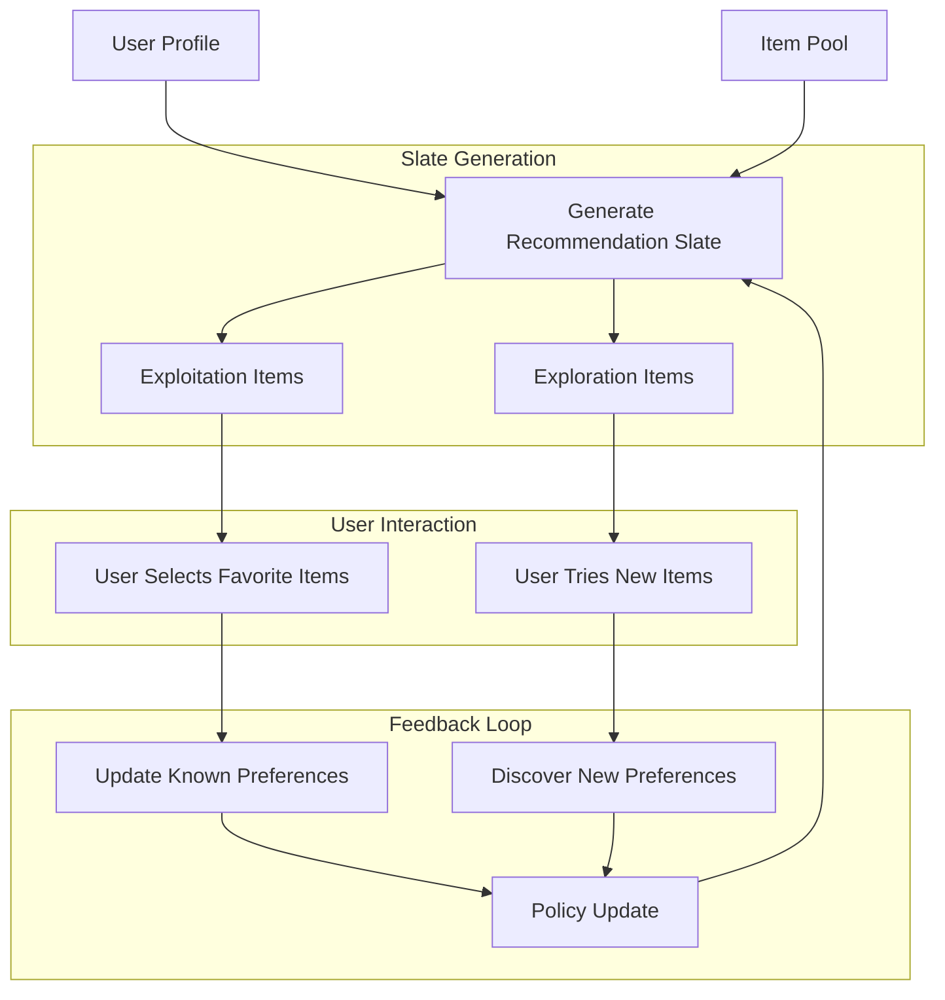
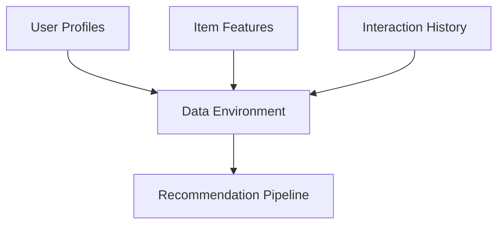
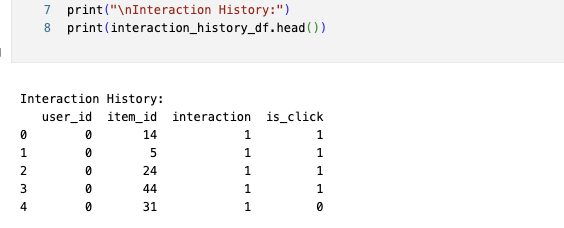
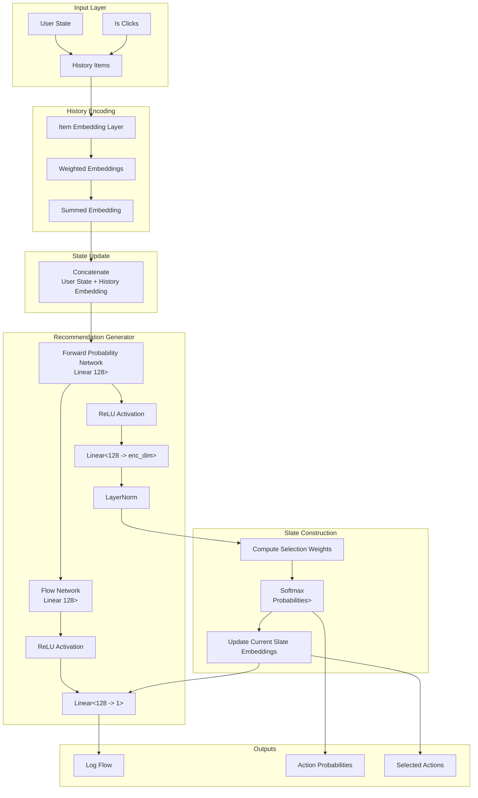

# Building an Online Recommendation with Generative Flow Networks (GFN)


## Why this blog?

I have spent several years working on recommendation systems, including AdNetwork-VCC, a content recommendation system for CocCoc.  Throughout this experience, I frequently encounter critical questions, such as:

- How can we build a system that generates diverse and high-quality recommendations for users?
- How do we effectively balance exploration and exploitation in online recommendations?
- How can we utilize feedback data to enhance recommendation quality and make people more engaged with the platform?

While working as a researcher at Torilab (a Japanese tech company based in Hanoi) I had the chance to work with graph-based recommendations and was particularly impressed by the solutions outlined in the GitHub repository GFN4Rec (https://github.com/CharlieMat/GFN4Rec). The GFN demonstrates the potential to generate diverse and high-quality recommendations through a robust feedback loop system. However, its implementation can be complex, causing challenges for many who struggle with its foundational concepts.

I aim to simplify these concepts and share insights on how to effectively build an online recommendation system utilizing GFN.


## Introduction

Recommender systems are ubiquitous in digital ecosystems, from e-commerce platforms to content streaming services. Traditional recommendation approaches often focus on static policies, but Generative Flow Networks (GFN) provide a novel paradigm for modeling the sequential dynamics of user interactions.

In this blog, we’ll explore the use of trained policies (e.g., SlateGFN_DB) for building an online recommendation prototype. I'll cover key components like data environment setup, policy training, agent updates, and feedback loops, all while illustrating the process with visual aids, including github code repository. I generated the sample data set for user profiles, item features, and interaction history to train the recommendation policy. The system are trying to optimize the click rewards. 


This diagram shows the interaction flow between the user, data environment, policy, and recommendation agent:




This our blog post outline:

1. What is a Generative Flow Network (GFN)?
2. Data Environment for Training
3. Training the Policy
4. Policy Deployment and Online Updates
5. Agent Update in Online Recommendations
6. Conclusion


## What is a Generative Flow Network (GFN)?

Generative Flow Networks (https://yoshuabengio.org/2022/03/05/generative-flow-networks/) are probabilistic models designed to generate diverse, sequential structures. They excel in scenarios where multiple outcomes need to be explored, such as recommending a slate of items to a user. Unlike traditional policies, GFNs allow us to generate sequences with a balance between exploration and exploitation, making them ideal for online recommendation systems.



From above diagram, you can see  User Profile and Item Pool: 
1. User Profile: Demographic data, preferences, and historical interactions.
2. Item Pool: Attributes of items (e.g., product categories, tags, ratings).


Our goal is to generate slates of items that balance user preferences with novel recommendations. GFNs achieve this by modeling the sequential interactions between users and items, allowing us to explore diverse outcomes while exploiting known preferences. There are two types of recommendations in GFNs:

1. Exploitation Items: High-probability recommendations based on known user preferences. 
2. Exploration Items: Low-probability recommendations to explore new interests. 

This is the example output of the SlateGFN_DB policy: 
```
Rank	Item	Type	Reason
1	Running Shoes	Exploitation	Known fitness interest.
2	Resistance Bands	Exploitation	Matches yoga-related history.
3	Duffel Bag	Exploration	Testing interest in travel gear.
```


Next, I will explain how to build an online recommendation system using GFN step by step.

## How to Build an Online Recommendation with GFN

### Step 1: Data Environment for Training

To build a robust recommendation prototype, we need a well-defined data environment:

1.	User Profiles: Demographics, preferences, and behavior data.
2.	Item Features: Attributes of items (e.g., product categories, tags, ratings).
3.	Interaction History: Historical data capturing user interactions with items (e.g., clicks, purchases, ratings).





Here, I will generate synthetic data for user profiles, item features, and interaction history to train the recommendation policy. The code for generating the data is available in the repository.

1. Daily Recommendations simulate recommendations for users over a timeline.
2. Session-Based Interactions allow us to model multiple touchpoints in a single user session.
3. Time Slots enable periodic updates (e.g., hourly recommendations).

```python
import torch
import torch.nn as nn
import torch.optim as optim
import numpy as np
import pandas as pd

# Set random seed for reproducibility
np.random.seed(42)
torch.manual_seed(42)

# Number of users and items
num_users = 100
num_items = 50

# Feature dimensions
user_feature_dim = 5
item_feature_dim = 5

# Generate user profiles
user_ids = np.arange(num_users)
user_features_array = np.random.randn(num_users, user_feature_dim)
user_profiles_df = pd.DataFrame(user_features_array, columns=[f'user_feature_{i}' for i in range(user_feature_dim)])
user_profiles_df.insert(0, 'user_id', user_ids)

# Adjust item IDs to start from 1 to handle padding index 0
item_ids = np.arange(1, num_items + 1)  # Now item_ids from 1 to num_items
num_items = num_items  # No need to adjust num_items
item_features_array = np.random.randn(num_items, item_feature_dim)
# Add padding row at index 0
padding_item_feature = np.zeros((1, item_feature_dim))
item_features_array = np.vstack([padding_item_feature, item_features_array])
item_features_df = pd.DataFrame(item_features_array, columns=[f'item_feature_{i}' for i in range(item_feature_dim)])
item_ids_with_padding = np.arange(0, num_items + 1)  # From 0 to num_items, where 0 is padding index
item_features_df.insert(0, 'item_id', item_ids_with_padding)

# Generate interaction history with is_click interaction
interaction_records = []
for user_id in user_ids:
    interacted_items = np.random.choice(item_ids[1:], size=np.random.randint(1, 10), replace=False)
    is_clicks = np.random.choice([0, 1], size=len(interacted_items))  # Random is_click values
    for item_id, is_click in zip(interacted_items, is_clicks):
        interaction_records.append({'user_id': user_id, 'item_id': item_id, 'interaction': 1, 'is_click': is_click})
interaction_history_df = pd.DataFrame(interaction_records)

# Convert user profiles to tensors
user_ids_tensor = torch.tensor(user_profiles_df['user_id'].values, dtype=torch.long)
user_features_tensor = torch.tensor(user_profiles_df.drop('user_id', axis=1).values, dtype=torch.float)

# Convert item features to tensors
item_ids_tensor = torch.tensor(item_features_df['item_id'].values, dtype=torch.long)
item_features_tensor = torch.tensor(item_features_df.drop('item_id', axis=1).values, dtype=torch.float)
```



### Step 2: Training the Policy

To train the recommendation agent:
1.  SlateGFN_DB generates recommendation slates for users.
2.  A reward function evaluates each slate based on metrics  like engagement or purchase likelihood.( is_click etc.)
3.  The training process iteratively updates the policy to maximize the cumulative reward.

The GFN policy learns to generate diverse and high-quality recommendations by:
1.	Exploring diverse item combinations.
2.	Exploiting known user preferences.


Design the SlateGFN_DB network ( the code you can find in the repository) to generate slates of items for users. The network learns to balance exploration and exploitation, ensuring that recommendations are both diverse and relevant. 

This is the architecture of the SlateGFN_DB policy network:



Train the policy using the following steps:
```python
# Training loop
num_epochs = 5
num_batches = 50

for epoch in range(num_epochs):
    epoch_loss = 0
    for _ in range(num_batches):
        # Reset environment and get observation
        observation = env.reset(batch_size)
        user_state = observation['user_profile']['uf_embedding']  # Shape: (B, state_dim)
        user_ids = observation['user_profile']['user_id']
        user_history = observation['user_history']

        # Get candidate items
        candidates = env.get_candidate_info()

        # For training, generate random slates (parent_slate)
        parent_slate = torch.randint(1, env.num_items + 1, (batch_size, slate_size)).to(device)

        # Forward pass
        out_dict = policy(user_state, candidates, parent_slate, user_history, is_train=True)

        # Get reward from environment
        user_feedback = env.step(user_ids, parent_slate)
        reward = user_feedback['reward']

        # Compute loss
        loss = policy.get_loss(out_dict, reward + 1e-6)  # Add small value to prevent log(0)

        # Backpropagation and optimization
        optimizer.zero_grad()
        loss.backward()
        optimizer.step()

        epoch_loss += loss.item()

    avg_loss = epoch_loss / num_batches
    print(f"Epoch {epoch + 1}/{num_epochs}, Loss: {avg_loss:.4f}")
```
```
OUTPUT:
/tmp/ipykernel_1581922/2984395016.py:44: UserWarning: Creating a tensor from a list of numpy.ndarrays is extremely slow. Please consider converting the list to a single numpy.ndarray with numpy.array() before converting to a tensor. (Triggered internally at /opt/conda/conda-bld/pytorch_1724788959220/work/torch/csrc/utils/tensor_new.cpp:278.)
  history_items_tensor = torch.tensor([h[0] for h in user_histories], dtype=torch.long).to(self.device)
Epoch 1/5, Loss: 0.0814
Epoch 2/5, Loss: 0.0554
Epoch 3/5, Loss: 0.0496
Epoch 4/5, Loss: 0.0472
Epoch 5/5, Loss: 0.0454
```


## Step 3: Policy Deployment and Online Updates

Once trained, the policy operates in an online setting, generating recommendations in real-time:
1.	User Selection: Select a subset of active users for recommendations.
2.	Recommendation Generation: Use the trained GFN policy to produce slates.
3.	Simulated Feedback: Gather feedback (e.g., clicks, purchases) to simulate user interactions.
4.	Policy Updates: Continuously update the policy using feedback data.

```maermaid
graph LR
    User[User Interactions] -->|Clicks, Purchases| Feedback[Simulated Feedback]
    Feedback --> Agent[Recommendation Agent]
    Agent --> Recommendations[Generated Recommendations]
    Recommendations --> User
    Feedback --> Update[Policy Update]
    Update --> Agent
```


```python
# •	The simple_policy function recommends items that the user has interacted with but did not click.
# •	If there are not enough such items, it fills the slate with random items not in the user’s history.
# •	This policy aims to re-engage users with items they showed interest in but did not click on.
simulate_with_policy(env, num_steps=2, batch_size=2) 
```

```
OUTPUT:
Interaction History:
   user_id  item_id  interaction  is_click
0        0       14            1         1
1        0        5            1         1
2        0       24            1         1
3        0       44            1         1
4        0       31            1         0
tensor([-0.2341,  1.5792,  0.7674, -0.4695,  0.5426])
Step 1/3
User ID: 88
Recommended Slate: [43 18 27 15 27]
Reward: 0.20
User History Items: [22 43 29 13 24 14  3 46  7  0]
User History Clicks: [0 0 0 0 0 0 1 1 0 0]
------------------------------
User ID: 78
Recommended Slate: [36 21 25  1 14]
Reward: 0.20
User History Items: [14 22 35  3  9 13 15  0  0  0]
User History Clicks: [0 0 0 1 0 0 0 0 0 0]

```


### Step 4: Agent Update in Online Recommendations


1. Exploration: The agent tests new item combinations to identify novel preferences.
2. Exploitation: The agent prioritizes high-probability interactions based on historical data.
3. Real-Time Adaptation: Policies are updated periodically, ensuring relevance in dynamic environments.


The agent learns iteratively:

1. Generate slates.
2. Simulate feedback using metrics like click-through rate (CTR) or purchase conversion rate.
3. Update the GFN policy.( call optimize function)


```python
# Simulation parameters
total_duration = 10  # Total simulation time in seconds
average_interarrival_time = 2  # Average time between user arrivals in seconds
slate_size = 5

# Initialize the environment
device = 'cpu'
env = DataEnvironment(user_features_tensor, item_features_tensor, interaction_history_df, slate_size, device)

# Run the real-time simulation
simulate_user_arrivals(env, total_duration, average_interarrival_time)

```

```
OUTPUT: 
User ID: 29
Recommended Slate: [32 27 20 42 50]
Reward: 0.40
User History Items: [17 37 23 41 42 50 36  7  0  0]
User History Clicks: [1 0 1 0 0 1 1 1 0 0]
------------------------------
User ID: 59
Recommended Slate: [29  3 34  2 31]
Reward: 0.20
User History Items: [26  3 33  7 18 10  0  0  0  0]
User History Clicks: [0 0 0 0 1 0 0 0 0 0]
------------------------------
User ID: 55
Recommended Slate: [26 28 44  6 24]
Reward: 0.00
User History Items: [32  0  0  0  0  0  0  0  0  0]
User History Clicks: [0 0 0 0 0 0 0 0 0 0]
------------------------------
```


## Conclusion

This prototype demonstrates how Generative Flow Networks can revolutionize online recommendation systems by combining sequential interaction modeling, exploration of diverse outcomes, and adaptive policies. Using a trained policy like SlateGFN_DB, you can build a scalable and robust recommendation engine for real-world applications.

As a next step, consider implementing this prototype with your own datasets to explore its potential for driving engagement and conversions in your platform.

This my code reporesitory for the blog post: [Building an Online Recommendation with Generative Flow Networks (GFN)](https://github.com/phuongdo/gflownet-blog)


     

